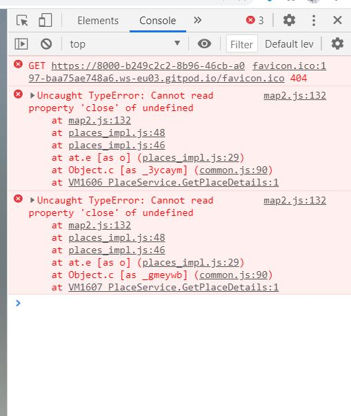

Interactive Front End Development Project Milestone 2 - Code Institute

![Screenshotproject]

# **_Sri Lanka Pearl of Asia_**

This is my second Milestone Project for the [Code Institute](https://codeinstitute.net/) Fullstack Web Developer Diploma. This project is designed to demostrate the skills learnt on the Interactive Frontend Development module. I have choosen to design a website where I can demostrate that I have augumented my HTML and CSS skill but also that I can use JavaScript with JQuery library and public API's to crate a more interactive website.

## **_UX_**

### **_Strategy_**

 I have designed this website to help the User explore different Sri Lankan locations. The User can view the locations on Google maps, use a search box in Google maps to search for facilities and other locations within the island. Use external links to check blogs and to be able to book accomodations. Also the User can use the contact form in the contact page to request more information of Sri Lanka.

 ### **_Scope_**

 The features I want to implement are :
 
 * Showing Google maps by using Google maps' API 

 * Ability to search facilities and places with search function in Google maps

 * EmalJs functionality 

 * Active web links 

 * Easy navigation and layout

 * Mobile first approach

### **_Structure_**

The different locations are devided in three main groups depending on what the User is interested in: Relaxing, Cultural and Nature. Inside each group the User will find links of two location's pages which will also be visible on the Google Map by clicking the custom markers. Google Map will use its own API to display custom markers for showing the location on the map and the use of Google API Places to be able to use a search bar whithin the map.

### **_Skeleton_**

The information for the locations will be represented in two way via the infowindows on the map's markers and via navbar pages links.

1. The User can view from Google maps the geographical location of the destinations and by clicking the map's markers can view few key informations. At the bottom of the information window, which will open when the user clicks on the marker'map, the link will gain access the page's locations in the Navbar.
2. The User can choose to view the location's information by overing on the drop down menu in the Navbar.
3. The User can access external blogs and website inside the locations' pages.
4. A contact page link will also be present in the Navbar with a "Home" button to redirect the user to teh home page if needed.
5. The footer in this webside will only hold the copyright logo 

### **_Surface_**

I am looking to achive a visually satisfying web site by using high quality pictures and minimalistic style. I have implemented mobile first approch by using Bootstrap 4. The website will be using as family font Lato for the paragraph and Raleway for menus and title. Both font are taken from [Google Font](https://fonts.google.com/) .
The colors will be minimal due to the usage of full screen pictures. Also I decided to use semi transparent Navbar and Footer because I think that this style gives the website a more streamlined style.
I have used the color #fafafa for navbar links, border and placeholders in the contact form, including the submit buttons. This color has also been used in the copyright text in the footer for: home page, contact us page.
The backgrond color for the text area is #e3edf1. TO COMPLETE

### **_User Story_**

* As a tourist I want to be able to discover where is the geographical location of Sri Lanka and where the locations stated in the website are located.
* As a tourist I want to be able to see different type of locations. 
* As a tourist I want to be able to gather more information about Sri Lanka by using links to external pages. 
* As a tourist I want to be able to , by using the search box in the map, search for  facilities and places to visit. 
* As a tourist I want to be able to use a contact form in case more information are needed.
* As a tourist I want to be able, in the future, to come back and check for new locations added to the website.

* As a local resident I want to be able to find more information about other locations in Sri Lanka via links to external pages and with the use of the interactive map. 

* As a local resident I want to be able, in the future,to come back to the web site to see if new locationS and informationS have been added to the website.

### **_Wireframe_**

Link to Wireframes folder: ADD WIREFRAME FOLDER

For designing the Wireframes I have used [Balsamiq](https://balsamiq.com/).
During the planning stage, when I have designed the Wireframes, I have made the landing page with a full picture and a button that when clicked will let you reach the map page.
After speaking with my mentor He suggested that the landing page with the button wasn't necessary, in his opinion, due to the fact that pictures where used in the page extesivily and the landing page with the button was only making the web site less efficient. After thinking about the suggestion and trying to add the page and use it, I realised that the landing page with the button wasn't necessary. I have left the unused wireframe inside the folder anyway.

## **_Features_**

### **_Existing Features_**
 
 * Navbar allow the tourist /local resident to access home page, locations'pages and contact page by clicking and by hovering the wording.
 * Google Maps allow the tourist /local resident to geographically locate Sri Lanka with the use of [Google Maps API](https://developers.google.com/maps/documentation/javascript/overview).
 * Google Maps allow the tourist /local resident to geographically locate different locations of Sri Lanka with the use of [Google Maps API](https://developers.google.com/maps/documentation/javascript/overview).
 * The search bar within Google Maps allow the tourist to search for locations or facilities in Sri Lanka and elsewhere with the use of [Google Places API](https://developers.google.com/places/web-service/overview).
 * The links inside the information window, which appear when clicking the map's markers, will direct the tourist/local resident to the location's pages which is the same page found in the Navbar.
 * The links inside the location's pages allow the tourist/local resident to look at external website to gather more informations.
 * The form in the contact page is using [EailJS](https://www.emailjs.com/) API functionality that will send an email to the developer email account when the tourist /local resident fill up the form completely and with the correct parameters.

### **_Features to be implemented_**

* Add current user [geolocation](https://developers.google.com/maps/documentation/javascript/geolocation) functionality. 
* Add [Google direction API](https://developers.google.com/maps/documentation/directions/overview).
* Add more locations to the list in Navbar.
* Add the functionality to book accomodation via this website.

## **_Credits_**

* The code for Google Maps API has been writter with the support of the documents written by Eamonn Smyth , [Google documentation](https://developers.google.com/maps/documentation/javascript/tutorials), [Youtube tutorial](https://www.youtube.com/watch?v=Xptz0GQ2DO4) by [Pradip Debnath](https://www.youtube.com/channel/UC43N9Z8Fm0gg1Lgpw0eS9rg).

* The code for Google map API search box functionality has been writter with the support of the [Google documentation](https://developers.google.com/maps/documentation/javascript/examples/places-searchbox#maps_places_searchbox-javascript).

* The code for showing info windows on searched markers has been written with the support of [Stackoverflow](https://stackoverflow.com/questions/44225974/how-can-i-add-info-window-in-places-searchbox)

* The marker's custom icons in the map are credited to [Maps Icons Collection](https://mapicons.mapsmarker.com).
* The code for adding hover over drop down functionality found at [Stack Overflow](https://stackoverflow.com/questions/50116307/how-to-make-hover-effect-instead-of-click-in-bootstrap-4-dropdown-menu).
* The code for backgrond picture using CSS was taken from [W3School](https://www.w3schools.com/howto/howto_css_full_page.asp).
* A special thanks for the support received by the tutoring team and my mentor.

### **_Bugs and fixes_**

* Issue 1 When using Google maps search box the search works but the icon displayed on the map related to the search are not rendering correctly on the map.

    Solution 1- Found that when Google Searchbox was trying to create a marker using the marker constructor for the related search , a key object `icon:` was used . This property was creating an icon on the map which wasn't rendered correctly. By removing the key object `icon:` from the marker constructor and the related variable called `icon` the issue has been solve. Now if I search a location or a facility a standard red marker will show without causing any issue. Also the search now is quicker.

* Issue 2 When opening and closing info windows on the map, specially after a search and clicking on the marker to show info windows, I get an intermittent error on the concole. Screen shot here 